# Koralytics Complete Database Schema & Entity Relationships

This document details the **complete database schema**, **Primary Keys (PK)**, **Foreign Keys (FK)**, **Field Definitions**, and **Relationships** (One-to-One, One-to-Many, Many-to-Many via Junction Tables, and TPT Inheritance) across the **Koralytics** system.

---

## Quick Reference Legend

| Symbol | Description |
| :--- | :--- |
| **PK** | Primary Key |
| **FK** | Foreign Key |
| **1 : 1** | One-to-One Relationship (e.g. Identity TPT Table Inheritance) |
| **1 : N** | One-to-Many Relationship |
| **N : M** | Many-to-Many Relationship (implemented via a Junction / Join Table) |

---

## 1. Global Entity Relationship Overview (Mermaid ERD)

```mermaid
erDiagram
    %% Identity TPT Inheritance
    AspNetUsers ||--|| Players : "1:1 (TPT)"
    AspNetUsers ||--|| Coaches : "1:1 (TPT)"
    AspNetUsers ||--|| Scouters : "1:1 (TPT)"
    AspNetUsers ||--|| Parents : "1:1 (TPT)"
    AspNetUsers ||--|| AcademyAdmins : "1:1 (TPT)"

    %% Academy Relationships
    Academies ||--o{ AcademyLocations : "1:N (Branch locations)"
    Academies ||--o{ AgeGroups : "1:N (Defines)"
    Academies ||--o{ Teams : "1:N (Owns)"
    Academies ||--o{ Tournaments : "1:N (Hosts)"
    Academies ||--o{ AcademyAdmins : "1:N (Employs)"

    %% N:M Junction Relationships
    Players ||--o{ PlayerAcademies : "N:M Junction"
    Academies ||--o{ PlayerAcademies : "N:M Junction"

    Players ||--o{ PlayerTeams : "N:M Junction"
    Teams ||--o{ PlayerTeams : "N:M Junction"

    Coaches ||--o{ CoachAcademies : "N:M Junction"
    Academies ||--o{ CoachAcademies : "N:M Junction"

    Coaches ||--o{ CoachTeams : "N:M Junction"
    Teams ||--o{ CoachTeams : "N:M Junction"

    Parents ||--o{ ParentPlayers : "N:M Junction"
    Players ||--o{ ParentPlayers : "N:M Junction"

    Tournaments ||--o{ TournamentTeams : "N:M Junction"
    Teams ||--o{ TournamentTeams : "N:M Junction"

    Scouters ||--o{ ScouterShortlists : "N:M Junction"
    Players ||--o{ ScouterShortlists : "N:M Junction"

    %% Match Relationships
    Teams ||--o{ Matches : "1:N (Home / Away)"
    Matches ||--o{ MatchLineups : "1:N (Lineup entries)"
    Matches ||--o{ MatchEvents : "1:N (Goals/Cards)"
    Matches ||--o{ MatchPlayerRatings : "1:N (Coach ratings)"

    %% Player Progression
    Players ||--o{ PlayerCards : "1:N (Player cards)"
    PlayerCards ||--o{ PlayerCategoryRatings : "1:N (Category scores)"

    %% Drill & Training
    DrillCategories ||--o{ DrillTemplates : "1:N (Templates)"
    Teams ||--o{ DrillSessions : "1:N (Conducts)"
    DrillSessions ||--o{ SessionAttendances : "1:N (Attendance)"
    DrillSessions ||--o{ DrillResults : "1:N (Drill scores)"
```

---

## 2. Identity & User Hierarchy (Table-Per-Type Inheritance)

System authentication utilizes ASP.NET Core Identity (`IdentityUser<int>`). Base columns reside in `AspNetUsers`, and specialized entity tables extend it via 1:1 foreign keys.

### 2.1 Table: `AspNetUsers` (`User`)
- **PK**: `Id` (int, IDENTITY)
- **Relationships**:
  - `1 : 1` with `Players(Id)`
  - `1 : 1` with `Coaches(Id)`
  - `1 : 1` with `Scouters(Id)`
  - `1 : 1` with `Parents(Id)`
  - `1 : 1` with `AcademyAdmins(Id)`
  - `1 : N` with `RefreshTokens(UserId)`

| Column Name | Data Type | Nullable | Description / Constraints |
| :--- | :--- | :--- | :--- |
| `Id` | `int` | NO | **PK**, Identity Seed (1,1) |
| `FirstName` | `nvarchar(50)` | NO | User First Name |
| `LastName` | `nvarchar(50)` | NO | User Last Name |
| `Gender` | `nvarchar(20)` | NO | "Male", "Female" |
| `BirthDate` | `datetime2` | NO | Date of birth |
| `ProfileImageUrl` | `nvarchar(max)` | YES | Path to avatar image |
| `Email` | `nvarchar(256)` | YES | Identity Email |
| `PhoneNumber` | `nvarchar(max)` | YES | Identity Phone Number |
| `IsActive` | `bit` | NO | Active/Inactive user flag |
| `CreatedAt` | `datetime2` | NO | User registration timestamp |

---

### 2.2 Table: `Players` (`Player`)
- **PK**: `Id` (int)
- **FK**: `Id` -> `AspNetUsers(Id)` (1:1 TPT Inheritance)
- **Relationships**:
  - `1 : N` with `PlayerCards`
  - `1 : N` with `PlayerHighlights`
  - `1 : N` with `PlayerGoals`
  - `1 : N` with `PlayerAchievements`
  - `1 : N` with `PlayerSubscriptions`
  - `N : M` with `Academies` (via `PlayerAcademies`)
  - `N : M` with `Teams` (via `PlayerTeams`)
  - `N : M` with `Parents` (via `ParentPlayers`)
  - `N : M` with `Scouters` (via `ScouterShortlists`)

| Column Name | Data Type | Nullable | Description / Constraints |
| :--- | :--- | :--- | :--- |
| `Id` | `int` | NO | **PK**, **FK** -> `AspNetUsers(Id)` |
| `DateOfBirth` | `datetime2` | NO | Date of birth |
| `Nationality` | `nvarchar(max)`| YES | Country of citizenship |
| `PreferredFoot` | `int` | NO | **Enum**: `PreferredFoot` (Right=1, Left=2, Both=3) |
| `WeakFootRating` | `int` | NO | Weak foot rating (1-5 stars) |
| `AvailabilityStatus`| `int` | NO | **Enum**: `AvailabilityStatus` (Available=1, Injured=2, Resting=3, Suspended=4) |
| `PlayStyleTag` | `nvarchar(max)`| YES | e.g., "Playmaker", "Target Man", "Poacher" |
| `ArchetypePlayerName`| `nvarchar(max)`| YES | AI comparison player (e.g. "Kevin De Bruyne") |
| `ArchetypeText` | `nvarchar(max)`| YES | Detailed archetype explanation text |

---

### 2.3 Table: `Coaches` (`Coach`)
- **PK**: `Id` (int)
- **FK**: `Id` -> `AspNetUsers(Id)` (1:1 TPT Inheritance)
- **Relationships**:
  - `N : M` with `Academies` (via `CoachAcademies`)
  - `N : M` with `Teams` (via `CoachTeams`)
  - `1 : N` with `MatchPlayerRatings(CoachId)`
  - `1 : N` with `DrillSessions(CoachId)`

| Column Name | Data Type | Nullable | Description / Constraints |
| :--- | :--- | :--- | :--- |
| `Id` | `int` | NO | **PK**, **FK** -> `AspNetUsers(Id)` |
| `Specialization` | `nvarchar(100)`| YES | Technical, Tactical, Fitness |
| `LicenseNumber` | `nvarchar(50)` | YES | Coaching license ID |
| `YearsOfExperience`| `int` | NO | Years coaching |

---

### 2.4 Table: `AcademyAdmins` (`AcademyAdmin`)
- **PK**: `Id` (int)
- **FK**: `Id` -> `AspNetUsers(Id)` (1:1 TPT Inheritance)
- **FK**: `AcademyId` -> `Academies(Id)` (N:1)

| Column Name | Data Type | Nullable | Description / Constraints |
| :--- | :--- | :--- | :--- |
| `Id` | `int` | NO | **PK**, **FK** -> `AspNetUsers(Id)` |
| `AcademyId` | `int` | NO | **FK** -> `Academies(Id)` |
| `JobTitle` | `nvarchar(100)`| YES | Executive Director, Manager |

---

## 3. Player Cards & Skill Progression Module

### 3.1 Table: `PlayerCards` (`PlayerCard`)
- **PK**: `Id` (int, IDENTITY)
- **FK**: `PlayerId` -> `Players(Id)`
- **Relationships**:
  - `N : 1` with `Players`
  - `1 : N` with `PlayerCategoryRatings(PlayerCardId)`

| Column Name | Data Type | Nullable | Description / Constraints |
| :--- | :--- | :--- | :--- |
| `Id` | `int` | NO | **PK**, Identity Seed (1,1) |
| `PlayerId` | `int` | NO | **FK** -> `Players(Id)` |
| `OverallRating` | `decimal(18,2)` | NO | Calculated overall FIFA-style card rating |
| `OverallTrainingAvg` | `decimal(18,2)` | NO | Average overall score from training sessions |
| `OverallTournamentAvg`| `decimal(18,2)` | NO | Average overall score from tournament matches |
| `NeedsRecalculation` | `bit` | NO | Flag indicating if card rating needs re-computation (default `false`) |
| `TransferClassification` | `int` | NO | **Enum**: `TransferClassification` (InsufficientData=0, Elite=1, Trainable=2, Natural=3, NeedsWork=4, Developing=5) |
| `LastCalculatedAt` | `datetime2` | NO | Timestamp of last calculation (default `DateTime.UtcNow`) |

---

### 3.2 Table: `PlayerCategoryRatings` (`PlayerCategoryRating`)
- **PK**: `Id` (int, IDENTITY)
- **FK**: `PlayerCardId` -> `PlayerCards(Id)`
- **FK**: `DrillCategoryId` -> `DrillCategories(Id)`
- **Relationships**:
  - `N : 1` with `PlayerCards`
  - `N : 1` with `DrillCategories`

| Column Name | Data Type | Nullable | Description / Constraints |
| :--- | :--- | :--- | :--- |
| `Id` | `int` | NO | **PK**, Identity Seed (1,1) |
| `PlayerCardId` | `int` | NO | **FK** -> `PlayerCards(Id)` |
| `DrillCategoryId` | `int` | NO | **FK** -> `DrillCategories(Id)` |
| `Score` | `decimal(18,2)` | NO | **Exact score** rating for category (Passing, Shooting, Dribbling, Pace, Defending, Physical) |
| `LastUpdatedAt` | `datetime2` | NO | Timestamp of last score update (default `DateTime.UtcNow`) |

---

## 4. Drill & Training Session Module

### 4.1 Table: `DrillCategories` (`DrillCategory`)
- **PK**: `Id` (int, IDENTITY)
- **Relationships**:
  - `1 : N` with `DrillTemplates(CategoryId)`
  - `1 : N` with `PlayerCategoryRatings(DrillCategoryId)`
  - `1 : N` with `MatchPlayerCategoryRatings(DrillCategoryId)`

| Column Name | Data Type | Nullable | Description / Constraints |
| :--- | :--- | :--- | :--- |
| `Id` | `int` | NO | **PK** |
| `Name` | `nvarchar(50)` | NO | Category Name (Passing, Shooting, Pace, Dribbling, Defending, Physical) |
| `Description` | `nvarchar(max)`| YES | Technical category description |

---

### 4.2 Table: `DrillTemplates` (`DrillTemplate`)
- **PK**: `Id` (int, IDENTITY)
- **FK**: `CategoryId` -> `DrillCategories(Id)`
- **FK**: `AcademyId` -> `Academies(Id)` (Nullable - null means system-wide template)

| Column Name | Data Type | Nullable | Description / Constraints |
| :--- | :--- | :--- | :--- |
| `Id` | `int` | NO | **PK**, Primary Key |
| `CategoryId` | `int` | NO | **FK** -> `DrillCategories(Id)` |
| `AcademyId` | `int` | YES | **FK** -> `Academies(Id)` (`null` = System-wide template) |
| `Name` | `nvarchar(max)`| NO | Drill template title/name |
| `DifficultyLevel` | `int` | NO | **Enum**: `DifficultyLevel` (Beginner=1, Intermediate=2, Advanced=3) |
| `DrillMode` | `int` | NO | **Enum**: `DrillMode` (Manual=1, SuccessOrMissed=2) |
| `IsShared` | `bit` | NO | Shared across academies flag (default `false`) |
| `CreatedAt` | `datetime2` | NO | Created timestamp |
| `CreatedBy` | `nvarchar(max)`| YES | User ID who created template |
| `LastModifiedAt` | `datetime2` | YES | Modified timestamp |
| `LastModifiedBy` | `nvarchar(max)`| YES | User ID who modified template |

---

### 4.3 Table: `DrillSessions` (`DrillSession`)
- **PK**: `Id` (int, IDENTITY)
- **FK**: `TeamId` -> `Teams(Id)`
- **FK**: `CoachId` -> `AspNetUsers(Id)`
- **Relationships**:
  - `1 : N` with `SessionAttendances(DrillSessionId)`
  - `1 : N` with `DrillResults(DrillSessionId)`
  - `1 : N` with `Matches(SessionId)`

| Column Name | Data Type | Nullable | Description / Constraints |
| :--- | :--- | :--- | :--- |
| `Id` | `int` | NO | **PK** |
| `TeamId` | `int` | NO | **FK** -> `Teams(Id)` |
| `CoachId` | `int` | NO | **FK** -> `AspNetUsers(Id)` |
| `SessionDate` | `datetime2` | NO | Date & time of session |
| `SessionType` | `int` | NO | **Enum**: `SessionType` |
| `Status` | `int` | NO | **Enum**: `SessionStatus` |

---

### 4.4 Table: `DrillResults` (`DrillResult`)
- **PK**: `Id` (int, IDENTITY)
- **FK**: `DrillSessionId` -> `DrillSessions(Id)`
- **FK**: `PlayerId` -> `Players(Id)`
- **FK**: `DrillCategoryId` -> `DrillCategories(Id)`

| Column Name | Data Type | Nullable | Description / Constraints |
| :--- | :--- | :--- | :--- |
| `Id` | `int` | NO | **PK** |
| `DrillSessionId` | `int` | NO | **FK** -> `DrillSessions(Id)` |
| `PlayerId` | `int` | NO | **FK** -> `Players(Id)` |
| `DrillCategoryId` | `int` | NO | **FK** -> `DrillCategories(Id)` |
| `Score` | `decimal(8,2)`| NO | Measured drill raw metric |
| `CalculatedRating`| `decimal(4,2)`| NO | Converted rating score |

---

## 5. Summary of All Database Foreign Keys

| Source Table | Foreign Key Column | Target Table | Target Column | Relationship Type |
| :--- | :--- | :--- | :--- | :--- |
| `Players` | `Id` | `AspNetUsers` | `Id` | **1 : 1 (TPT)** |
| `Coaches` | `Id` | `AspNetUsers` | `Id` | **1 : 1 (TPT)** |
| `Scouters` | `Id` | `AspNetUsers` | `Id` | **1 : 1 (TPT)** |
| `Parents` | `Id` | `AspNetUsers` | `Id` | **1 : 1 (TPT)** |
| `AcademyAdmins` | `Id` | `AspNetUsers` | `Id` | **1 : 1 (TPT)** |
| `PlayerCards` | `PlayerId` | `Players` | `Id` | **N : 1** |
| `PlayerCategoryRatings`| `PlayerCardId` | `PlayerCards` | `Id` | **N : 1** |
| `PlayerCategoryRatings`| `DrillCategoryId` | `DrillCategories` | `Id` | **N : 1** |
| `DrillTemplates` | `CategoryId` | `DrillCategories` | `Id` | **N : 1** |
| `DrillTemplates` | `AcademyId` | `Academies` | `Id` | **N : 1 (Optional)** |
| `PlayerAcademies` | `PlayerId` | `Players` | `Id` | **N : M Junction** |
| `PlayerAcademies` | `AcademyId` | `Academies` | `Id` | **N : M Junction** |
| `PlayerTeams` | `PlayerId` | `Players` | `Id` | **N : M Junction** |
| `PlayerTeams` | `TeamId` | `Teams` | `Id` | **N : M Junction** |
| `CoachAcademies` | `CoachUserId` | `Coaches` | `Id` | **N : M Junction** |
| `CoachAcademies` | `AcademyId` | `Academies` | `Id` | **N : M Junction** |
| `CoachTeams` | `CoachUserId` | `Coaches` | `Id` | **N : M Junction** |
| `CoachTeams` | `TeamId` | `Teams` | `Id` | **N : M Junction** |
| `ParentPlayers` | `ParentId` | `Parents` | `Id` | **N : M Junction** |
| `ParentPlayers` | `PlayerId` | `Players` | `Id` | **N : M Junction** |
| `Teams` | `AcademyId` | `Academies` | `Id` | **N : 1** |
| `Teams` | `AgeGroupId` | `AgeGroups` | `Id` | **N : 1** |
| `Matches` | `HomeTeamId` | `Teams` | `Id` | **N : 1** |
| `Matches` | `AwayTeamId` | `Teams` | `Id` | **N : 1** |
| `Matches` | `TournamentId` | `Tournaments` | `Id` | **N : 1 (Optional)** |
| `Matches` | `SessionId` | `DrillSessions` | `Id` | **N : 1 (Optional)** |
| `MatchLineups` | `MatchId` | `Matches` | `Id` | **N : 1** |
| `MatchLineups` | `PlayerId` | `Players` | `Id` | **N : 1** |
| `MatchLineups` | `TeamId` | `Teams` | `Id` | **N : 1** |
| `MatchPlayerRatings`| `MatchId` | `Matches` | `Id` | **N : 1** |
| `MatchPlayerRatings`| `PlayerId` | `Players` | `Id` | **N : 1** |
| `MatchPlayerRatings`| `CoachId` | `AspNetUsers` | `Id` | **N : 1** |
| `MatchPlayerCategoryRatings`| `MatchPlayerRatingId` | `MatchPlayerRatings` | `Id` | **N : 1** |
| `MatchPlayerCategoryRatings`| `DrillCategoryId` | `DrillCategories` | `Id` | **N : 1** |
| `DrillResults` | `DrillSessionId` | `DrillSessions` | `Id` | **N : 1** |
| `DrillResults` | `PlayerId` | `Players` | `Id` | **N : 1** |
| `DrillResults` | `DrillCategoryId` | `DrillCategories` | `Id` | **N : 1** |
